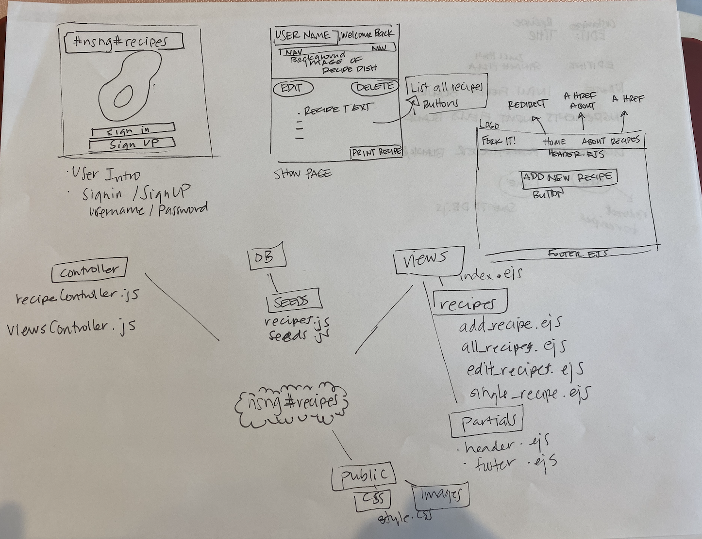

# nsngFoodRecipesCrudApp
CRUD App for no sugar no grain health food recipes created by fellow Yettsy Knapp 
General Assembly SEI6 Denver, CO

![wireframe image for NSNG recipes]
Follow my project management steps on my public Trello site:  https://trello.com/b/TGA9a6F5

MVP: Most basic version of the site 
____________________________________________

Providing my user a location within the browser to join to have saved nsng recipes for when they are prepping for their next meal. 
Site will provide a list of predetermined ketogenic friendly recipes that contain no sugars or grains. Users will be able to have their recipes listed on their page as well as a way to edit their favorite recipes and save them for later use. 

________________________________________________
User Story:
Our user wants to have a place where they may create, view, edit, and delete recipes for no sugar no grain food options.
On welcome page, the user will have the option to signup to load account with Username, email and password
On 

Users should be able to accomplish the following:

-Access the database of recipes through authentication
-View link to images of the recipes that are not editable
-Create user defined recipes and allow edit to remove or      add food parameters
-Delete editable recipes that don't look appealing to the     user
___________________________________________
Model schema sample for user 

    const userSchema = mongoose.Schema){
    name: {type: String, required: true },
    password: {type: String, required: true},
    email: {type: String, required: true},
    }) timestamp: true,
    });

    const recipeSchema = mongoose.Schema({
    title: {type: String, required: true},
    body: String,
    Ingredients: [{
        Name: String,
        Measurement: String,
    }]
    recipesEditable: Boolean
});
___________________________________________
Requirements:
-Node
-MongoDB
-espress JS framework
-Mongoose
_____________________________________________
Installation Instructions:

Stretch Goal/Phase Two:
Setting up the user to have a favorite recipe section
Styling to site
Improving authentication
intelligent formating for user to add their own comments for recipes they dislike